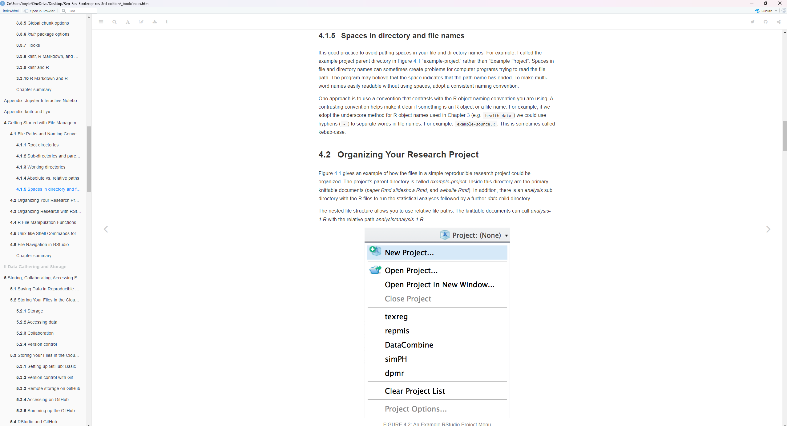

Display machine information for reproducibility:
```{r}
#| eval: true
sessionInfo()
```

## Q1. Git/GitHub

GitHub created. Repository Created.

## Q2. Data ethics training

Display the verification links to your completion report and completion certificate here.

[Completion Report](citiprogram.org/verify/?kca45a062-ea0a-4df1-9e13-71ca2b20e7f0-67410439)

Here is the Completion report in full: citiprogram.org/verify/?kca45a062-ea0a-4df1-9e13-71ca2b20e7f0-67410439

[Completion Certificate](citiprogram.org/verify/?wad4b3eab-a4ed-4be4-b940-dce1260f4f13-67410439)

Here is the Certificate link in full: citiprogram.org/verify/?wad4b3eab-a4ed-4be4-b940-dce1260f4f13-67410439

## Q3. Linux Shell Commands


1.
```{bash}
#| eval: true
# Create mirror location for mimic dataset
ln -s "C:\Users\boyle\Downloads\mimic-iv-3.1\mimic-iv-3.1" ~/mimic
```

```{bash}
#| eval: true
# content of mimic folder
ls -l ~/mimic/
```

2. Display the contents in the folders `hosp` and `icu` using Bash command `ls -l`.

```{bash}
#| eval: true
# content of hosp folder in mimic folder
ls -l ~/mimic/hosp
```

Contains hospital level data for patients: labs, micro, and electronic medication administration.

```{bash}
#| eval: true
# content of icu folder in mimic folder
ls -l ~/mimic/icu
```

Contains ICU level data. These are the event tables, and are identical in structure to MIMIC-III (chartevents, etc)

Why are these data files distributed as `.csv.gz` files instead of `.csv` (comma separated values) files?

Typically this is done to reduce file size, as this dataset is rather large.

3. Briefly describe what Bash commands `zcat`, `zless`, `zmore`, and `zgrep` do.

zcat: Allows user to view a compressed file without uncompressing the file

zless: Can view compressed files interactively, going page by page.

zmore: same as zless but has reduced navigation options.

zgrep: can find patterns in compressed files.

4. (Looping in Bash) What's the output of the following bash script?
```{bash}
#| eval: false
for datafile in ~/mimic/hosp/{a,l,pa}*.gz
do
  ls -l $datafile
done
```
This prints out the file location of gz files that start with the letters "a", "l", and "pa."

Display the number of lines in each data file using a similar loop. (Hint: combine linux commands `zcat <` and `wc -l`.)

```{bash}
#| eval: false
for datafile in ~/mimic/hosp/{a,l,pa}*.gz
do
  zcat $datafile | wc -l
done
```

The result printed was: 546029


5. Display the first few lines of `admissions.csv.gz`.
```{bash}
#| eval: false
zcat ~/mimic/hosp/admissions.csv.gz | head
```

Here is what was printed: subject_id,hadm_id,admittime,dischtime,deathtime,admission_type,admit_provider_id,admission_location,discharge_location,insurance,language,marital_status,race,edregtime,edouttime,hospital_expire_flag
10000032,22595853,2180-05-06 22:23:00,2180-05-07 17:15:00,,URGENT,P49AFC,TRANSFER FROM HOSPITAL,HOME,Medicaid,English,WIDOWED,WHITE,2180-05-06 19:17:00,2180-05-06 23:30:00,0
10000032,22841357,2180-06-26 18:27:00,2180-06-27 18:49:00,,EW EMER.,P784FA,EMERGENCY ROOM,HOME,Medicaid,English,WIDOWED,WHITE,2180-06-26 15:54:00,2180-06-26 21:31:00,0
10000032,25742920,2180-08-05 23:44:00,2180-08-07 17:50:00,,EW EMER.,P19UTS,EMERGENCY ROOM,HOSPICE,Medicaid,English,WIDOWED,WHITE,2180-08-05 20:58:00,2180-08-06 01:44:00,0
10000032,29079034,2180-07-23 12:35:00,2180-07-25 17:55:00,,EW EMER.,P06OTX,EMERGENCY ROOM,HOME,Medicaid,English,WIDOWED,WHITE,2180-07-23 05:54:00,2180-07-23 14:00:00,0
10000068,25022803,2160-03-03 23:16:00,2160-03-04 06:26:00,,EU OBSERVATION,P39NWO,EMERGENCY ROOM,,,English,SINGLE,WHITE,2160-03-03 21:55:00,2160-03-04 06:26:00,0
10000084,23052089,2160-11-21 01:56:00,2160-11-25 14:52:00,,EW EMER.,P42H7G,WALK-IN/SELF REFERRAL,HOME HEALTH CARE,Medicare,English,MARRIED,WHITE,2160-11-20 20:36:00,2160-11-21 03:20:00,0
10000084,29888819,2160-12-28 05:11:00,2160-12-28 16:07:00,,EU OBSERVATION,P35NE4,PHYSICIAN REFERRAL,,Medicare,English,MARRIED,WHITE,2160-12-27 18:32:00,2160-12-28 16:07:00,0
10000108,27250926,2163-09-27 23:17:00,2163-09-28 09:04:00,,EU OBSERVATION,P40JML,EMERGENCY ROOM,,,English,SINGLE,WHITE,2163-09-27 16:18:00,2163-09-28 09:04:00,0
10000117,22927623,2181-11-15 02:05:00,2181-11-15 14:52:00,,EU OBSERVATION,P47EY8,EMERGENCY ROOM,,Medicaid,English,DIVORCED,WHITE,2181-11-14 21:51:00,2181-11-15 09:57:00,0


How many rows are in this data file, excluding the header line?
```{bash}
#| eval: false
~/mimic/hosp/admissions.csv.gz | tail -n +2 | wc -l
```

This printed the result: 546028

Each `hadm_id` identifies a hospitalization. How many hospitalizations are in this data file?


```{bash}
#| eval: false
zcat ~/mimic/hosp/admissions.csv.gz | cut -d',' -f2 | tail -n +2 | sort | uniq | wc -l
```

This printed: 546028 unique hospitalization ids

How many unique patients (identified by `subject_id`) are in this data file? 

```{bash}
#| eval: false
zcat ~/mimic/hosp/admissions.csv.gz | cut -d',' -f1 | tail -n +2 | sort | uniq | wc -l
```

This printed: 223452 unique subject ids.


Do they match the number of patients listed in the `patients.csv.gz` file? 

```{bash}
#| eval: false
zcat ~/mimic/hosp/patients.csv.gz | cut -d',' -f1 | tail -n +2 | sort | uniq | wc -l
```

No they do not. This bash command printed: 364627 unique subject ids.

6. What are the possible values taken by each of the variable `admission_type`, `admission_location`, `insurance`, and `ethnicity`?

Admission Type
```{bash}
#| eval: false
zcat ~/mimic/hosp/admissions.csv.gz | cut -d',' -f6 | tail -n +2 | sort | uniq
```

This printed the following variables:
AMBULATORY OBSERVATION
DIRECT EMER.
DIRECT OBSERVATION
ELECTIVE
EU OBSERVATION
EW EMER.
OBSERVATION ADMIT
SURGICAL SAME DAY ADMISSION
URGENT

Admission Location
```{bash}
#| eval: false
zcat ~/mimic/hosp/admissions.csv.gz | cut -d',' -f8 | tail -n +2 | sort | uniq
```

This printed the following locations:
AMBULATORY SURGERY TRANSFER
CLINIC REFERRAL
EMERGENCY ROOM
INFORMATION NOT AVAILABLE
INTERNAL TRANSFER TO OR FROM PSYCH
PACU
PHYSICIAN REFERRAL
PROCEDURE SITE
TRANSFER FROM HOSPITAL
TRANSFER FROM SKILLED NURSING FACILITY
WALK-IN/SELF REFERRAL

Race
```{bash}
#| eval: false
zcat ~/mimic/hosp/admissions.csv.gz | cut -d',' -f13 | tail -n +2 | sort | uniq
```

This printed the following ethnicities:
AMERICAN INDIAN/ALASKA NATIVE
ASIAN
ASIAN - ASIAN INDIAN
ASIAN - CHINESE
ASIAN - KOREAN
ASIAN - SOUTH EAST ASIAN
BLACK/AFRICAN
BLACK/AFRICAN AMERICAN
BLACK/CAPE VERDEAN
BLACK/CARIBBEAN ISLAND
HISPANIC OR LATINO
HISPANIC/LATINO - CENTRAL AMERICAN
HISPANIC/LATINO - COLUMBIAN
HISPANIC/LATINO - CUBAN
HISPANIC/LATINO - DOMINICAN
HISPANIC/LATINO - GUATEMALAN
HISPANIC/LATINO - HONDURAN
HISPANIC/LATINO - MEXICAN
HISPANIC/LATINO - PUERTO RICAN
HISPANIC/LATINO - SALVADORAN
MULTIPLE RACE/ETHNICITY
NATIVE HAWAIIAN OR OTHER PACIFIC ISLANDER
OTHER
PATIENT DECLINED TO ANSWER
PORTUGUESE
SOUTH AMERICAN
UNABLE TO OBTAIN
UNKNOWN
WHITE
WHITE - BRAZILIAN
WHITE - EASTERN EUROPEAN
WHITE - OTHER EUROPEAN
WHITE - RUSSIAN

Also report the count for each unique value of these variables in decreasing order. 

Admission Type
```{bash}
#| eval: false
zcat ~/mimic/hosp/admissions.csv.gz | cut -d',' -f6 | tail -n +2 | sort | uniq -c | sort -nr
```

This prints:
177459 EW EMER.
 119456 EU OBSERVATION
  84437 OBSERVATION ADMIT
  54929 URGENT
  42898 SURGICAL SAME DAY ADMISSION
  24551 DIRECT OBSERVATION
  21973 DIRECT EMER.
  13130 ELECTIVE
   7195 AMBULATORY OBSERVATION

Admission Location
```{bash}
#| eval: false
zcat ~/mimic/hosp/admissions.csv.gz | cut -d',' -f8 | tail -n +2 | sort | uniq -c | sort -nr
```

This prints:
244179 EMERGENCY ROOM
 163228 PHYSICIAN REFERRAL
  56227 TRANSFER FROM HOSPITAL
  42365 WALK-IN/SELF REFERRAL
  12965 CLINIC REFERRAL
   8518 PROCEDURE SITE
   6317 TRANSFER FROM SKILLED NURSING FACILITY
   5837 INTERNAL TRANSFER TO OR FROM PSYCH
   5734 PACU
    402 INFORMATION NOT AVAILABLE
    255 AMBULATORY SURGERY TRANSFER
      1
      
Race
```{bash}
#| eval: false
zcat ~/mimic/hosp/admissions.csv.gz | cut -d',' -f13 | tail -n +2 | sort | uniq -c | sort -nr
```

This prints:
 336538 WHITE
  75482 BLACK/AFRICAN AMERICAN
  19788 OTHER
  13972 WHITE - OTHER EUROPEAN
  13870 UNKNOWN
  10903 HISPANIC/LATINO - PUERTO RICAN
   8287 HISPANIC OR LATINO
   7809 ASIAN
   7644 ASIAN - CHINESE
   6597 WHITE - RUSSIAN
   6205 BLACK/CAPE VERDEAN
   6070 HISPANIC/LATINO - DOMINICAN
   3875 BLACK/CARIBBEAN ISLAND
   3495 BLACK/AFRICAN
   3478 UNABLE TO OBTAIN
   2162 PATIENT DECLINED TO ANSWER
   2082 PORTUGUESE
   1973 ASIAN - SOUTH EAST ASIAN
   1886 WHITE - EASTERN EUROPEAN
   1858 HISPANIC/LATINO - GUATEMALAN
   1661 ASIAN - ASIAN INDIAN
   1526 WHITE - BRAZILIAN
   1320 HISPANIC/LATINO - SALVADORAN
   1247 AMERICAN INDIAN/ALASKA NATIVE
    920 HISPANIC/LATINO - COLUMBIAN
    883 HISPANIC/LATINO - MEXICAN
    774 SOUTH AMERICAN
    725 HISPANIC/LATINO - HONDURAN
    664 ASIAN - KOREAN
    641 HISPANIC/LATINO - CUBAN
    603 HISPANIC/LATINO - CENTRAL AMERICAN
    596 MULTIPLE RACE/ETHNICITY
    494 NATIVE HAWAIIAN OR OTHER PACIFIC ISLANDER
    

7. The `icusays.csv.gz` file contains all the ICU stays during the study period. How many ICU stays, identified by `stay_id`, are in this data file?

```{bash}
#| eval: false
zcat ~/mimic/icu/icustays.csv.gz | cut -d',' -f3 | tail -n +2 | sort | uniq | wc -l
```

This prints: 94458 entries for stay_id

How many unique patients, identified by `subject_id`, are in this data file?

```{bash}
#| eval: false
zcat ~/mimic/icu/icustays.csv.gz | cut -d',' -f1 | tail -n +2 | sort | uniq | wc -l
```

We find 65366 entries in subject_id.

8. _To compress, or not to compress. That's the question._ Let's focus on the big data file `labevents.csv.gz`. Compare compressed gz file size to the uncompressed file size.


```{bash}
#| eval: false
gzip -l ~/mimic/hosp/labevents.csv.gz
```

This prints the size for compressed and uncompressed version of labevents.csv.gz

We find the compressed file is 2592909134 bytes and the uncompressed file size is 18402851720 bytes.


Compare the run times of `zcat < ~/mimic/labevents.csv.gz | wc -l` versus `wc -l labevents.csv`.

```{bash}
#| eval: false
time zcat < ~/mimic/hosp/labevents.csv.gz | wc -l
```

My system had the following results:
real    1m6.293s
user    1m4.812s
sys     0m9.109s

```{bash}
#| eval: false
time wc -l  ~/mimic/hosp/labevents.csv
```

After unpacking the compressed files, my system had the following time:
real    0m0.049s
user    0m0.015s
sys     0m0.015s

Discuss the trade off between storage and speed for big data files.

The increased speed with uncompressed large data files can be 100s of factors faster to work with. However these data files can be incredibly large. It may become difficult to work with multiple large datasets at once on a single system. 

## Q4. Who's popular in Price and Prejudice

1. 
```{bash}
#| eval: false
wget -nc http://www.gutenberg.org/cache/epub/42671/pg42671.txt
```
Explain what `wget -nc` does.

Wget is a command in linux that downloads files from url codes. The -nc option stands for “no clobber” which is used to prevent overwriting files that already exist.

Complete the following loop to tabulate the number of times each of the four characters is mentioned using Linux commands.
```{bash}
#| eval: false
wget -nc http://www.gutenberg.org/cache/epub/42671/pg42671.txt
for char in "Elizabeth" "Jane" "Lydia" "Darcy"
do
  echo "$char:"
  grep -o -i "$char" pg42671.txt | wc -l
done
```

This prints: 

Elizabeth:
634
Jane:
293
Lydia:
171
Darcy:
418


2. What's the difference between the following two commands?
```{bash}
#| eval: false
echo 'hello, world' > test1.txt
```
and
```{bash}
#| eval: false
echo 'hello, world' >> test2.txt
```

The first line of code ‘>’ overwrites the contents of test1.txt. If there was any data in test1.txt it would of been completely replaced with the string ‘hello, world’

The 2nd line of code applies an appending operator ‘>>’ to the .txt file. This means if test2.txt already had data in it, the string ‘hello, world’ would have been added to the end of the file.

3. Using your favorite text editor (e.g., `vi`), type the following and save the file as `middle.sh`:
```{bash eval=FALSE}
#!/bin/sh
# Select lines from the middle of a file.
# Usage: bash middle.sh filename end_line num_lines
head -n "$2" "$1" | tail -n "$3"
```
Using `chmod` to make the file executable by the owner, and run
```{bash}
#| eval: false
./middle.sh pg42671.txt 20 5
```
Explain the output. Explain the meaning of `"$1"`, `"$2"`, and `"$3"` in this shell script. Why do we need the first line of the shell script?

This output takes the first 20 lines of the file pg42671.txt and then prints the last 5 lines from the first 20.
The "$1", "$2", and "$3" are known as positional parameters. They represent the values we provide after the script is run. In this case $1 represents the filename (pg42671.txt), $2 represents the number of “head” lines we want to look at, and $3 represents the number of “tail” lines we want to display.

The first line of the shell script tells the operating system what interpreter we need to use to run the script “middle.sh.” If we did not do this, we could use the wrong interpreter for the script which will cause the executable to run incorrectly and may lead to many errors.


## Q5. More fun with Linux

Try following commands in Bash and interpret the results: `cal`, `cal 2025`, `cal 9 1752` (anything unusual?), `date`, `hostname`, `arch`, `uname -a`, `uptime`, `who am i`, `who`, `w`, `id`, `last | head`, `echo {con,pre}{sent,fer}{s,ed}`, `time sleep 5`, `history | tail`.


Cal: prints out the current calendar month and year

Cal 2025: prints out all calendar months of the specified year

Cal 9 1752: should print out the month of september (9) in the year 1752
For some reason “cal 9 1752” prints a calendar of September with missing days. This is because this is when people switched from the Julian calendar to the Gregorian calendar.

Date: prints out the exact date and time that the OS has.

Hostname: prints the host name of the linux user. In my case this is the name of the PC.

Arch: prints out the architecture of the cpu.

uname -a: prints out all (-a for all) information about the system linux is being run on.

Uptime: prints how long the system has been running since it was last booted. Also shows number of users and the load average, which is a measurement of the average number of processes waiting to be executed by the cpu.

who am i:prints the username of the current logged in user

Who: prints the information about all users who are logged into the system. Displays the username, what terminal and login time.

W: an expanded command on “who” this prints out a wide variety of information about users on the system. This includes current activity and the time they’ve been idle as well as the system load.

Id: prints the users uid (user id) and the username associated with that id, the GID which is the user's primary group (usually this is the same as the uid) and other administrative or otherwise ids associated with the user.

Last | head : provides the last logged in users on the system. Prints a history of user logins and shows when users logged in and out. Also shows the duration of the user’s sessions and the IP address. Head will provide the first 10 lines of the “last” output

echo {con,pre}{sent,fer}{s,ed}: this line takes advantage of the brace expansion in linux. Linux will generate multiple strings passed on a pattern specified by us.

time sleep 5: the time command measures the amount of time another command takes. The sleep command tells the OS to pause or delay an execution for a specified amount of time, in this case 5 seconds.

history | tail: prints the history of commands ran in the current instance of this shell. Tail specifies to only print the last 10 arguments of history.

## Q6. Book

1. Git clone the repository <https://github.com/christophergandrud/Rep-Res-Book> for the book _Reproducible Research with R and RStudio_ to your local machine. Do **not** put this repository within your homework repository `biostat-203b-2025-winter`.

2. Open the project by clicking `rep-res-3rd-edition.Rproj` and compile the book by clicking `Build Book` in the `Build` panel of RStudio. (Hint: I was able to build `git_book` and `epub_book` directly. For `pdf_book`, I needed to add a line `\usepackage{hyperref}` to the file `Rep-Res-Book/rep-res-3rd-edition/latex/preabmle.tex`.)

The point of this exercise is (1) to obtain the book for free and (2) to see an example how a complicated project such as a book can be organized in a reproducible way. Use `sudo apt install PKGNAME` to install required Ubuntu packages and `tlmgr install PKGNAME` to install missing TexLive packages.

For grading purpose, include a screenshot of Section 4.1.5 of the book here.

