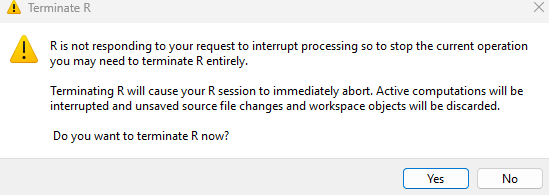
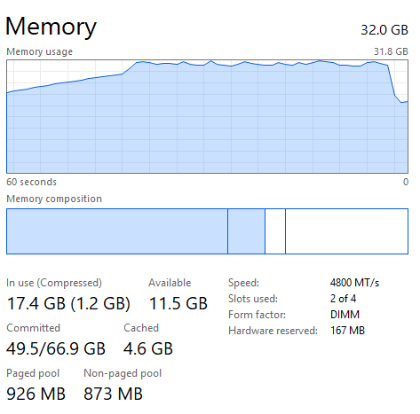

Display machine information for reproducibility:
```{r}
sessionInfo()
```

Load necessary libraries (you can add more as needed).
```{r setup}
library(arrow)
library(data.table)
library(duckdb)
library(memuse)
library(pryr)
library(R.utils)
library(tidyverse)
```

Display memory information of your computer
```{r}
memuse::Sys.meminfo()
```

In this exercise, we explore various tools for ingesting the [MIMIC-IV](https://physionet.org/content/mimiciv/3.1/) data introduced in [homework 1](https://ucla-biostat-203b.github.io/2025winter/hw/hw1/hw1.html).

Display the contents of MIMIC `hosp` and `icu` data folders:

```{bash}
cd
ls -l ~/mimic/hosp/
```

```{bash}
ls -l ~/mimic/icu/
```

## Q1. `read.csv` (base R) vs `read_csv` (tidyverse) vs `fread` (data.table)

### Q1.1 Speed, memory, and data types

There are quite a few utilities in R for reading plain text data files. Let us test the speed of reading a moderate sized compressed csv file, `admissions.csv.gz`, by three functions: `read.csv` in base R, `read_csv` in tidyverse, and `fread` in the data.table package.

```{r}
#measuring time difference
read_time_1 <- system.time(read_csv("~/mimic/hosp/admissions.csv.gz"))
read_time_2 <- system.time(read.csv("~/mimic/hosp/admissions.csv.gz"))
read_time_3 <- system.time(fread("~/mimic/hosp/admissions.csv.gz"))

print("Time for read_csv")
print(read_time_1)

print("Time for read.csv")
print(read_time_2)

print("Time for fread")
print(read_time_3)
```

```{r}
#measuring parsing difference
cat("Structure of data frame from read_csv:\n")
df_read_csv <- read_csv("~/mimic/hosp/admissions.csv.gz")
str(df_read_csv)

cat("\nStructure of data frame from read.csv:\n")
df_read.csv <- read.csv("~/mimic/hosp/admissions.csv.gz")
str(df_read.csv)

cat("\nStructure of data frame from fread:\n")
df_fread <- fread("~/mimic/hosp/admissions.csv.gz")
str(df_fread)

cat("\nColumn types for read_csv:\n")
print(sapply(df_read_csv, class))

cat("\nColumn types for read.csv:\n")
print(sapply(df_read.csv, class))

cat("\nColumn types for fread:\n")
print(sapply(df_fread, class))

#compare memory
cat("Memory usage of df_read_csv (read_csv):\n")
print(object_size(df_read_csv))

cat("\nMemory usage of df_read_csv_base (read.csv):\n")
print(object_size(df_read.csv))

cat("\nMemory usage of df_fread (read.csv):\n")
print(object_size(df_fread))

```
Which function is fastest?
read_csv was nearly 4 times faster than read.csv. However fread beats both
functions out, being twice as fast as read_csv and nearly 8 times faster than
read.csv.

Is there difference in the (default) parsed data types?
Yes. Read_csv and fread is able to distinguish data and time formats automatically.
read.csv treats these same columns as "characters." 
Read_csv treats certain columns as "numeric" while read.csv and fread treats them as 
integers. The difference here is subtle, but typically "numeric" or "double
floating" data points typically have slightly increased utility, like storing
decimals.

How much memory does each resultant dataframe or tibble use?
Memory usage of read_csv:
70.02 MB
Memory usage of read.cvs:
200.10 MB
Memory usage of fread:
63.47 MB

read.csv uses almost 3 times the memory as read_csv and nearly 4 times the
memory of fread.

### Q1.2 User-supplied data types

Re-ingest `admissions.csv.gz` by indicating appropriate column data types 
in `read_csv`. Does the run time change?

Yes the run time is slightly after after ingesting (about 0.8 seconds faster).

How much memory does the result tibble use?

The memory taken is now 59.10 MB compared to the original 70.02 MB  
(Hint: `col_types` argument in `read_csv`.)

from read_csv we can see a few ingests we can do.
subject_id and hadm_id can become an integer.
We could make race a factor and martial status.
We can make hospital_expire_flag a factor (has binary output).

```{r}

read_time_injest <- system.time({
  ingested_csv <- read_csv("~/mimic/hosp/admissions.csv.gz", 
                           col_types = cols(
                             subject_id = col_integer(),
                             hadm_id = col_integer(),
                             hospital_expire_flag = col_factor(),
                             marital_status = col_factor(),
                             race = col_factor()
                           ))
})
print("Time for injest")
print(read_time_injest)

cat("\nMemory usage of injested dataframe (read.csv):\n")
print(object_size(ingested_csv))

```


## Q2. Ingest big data files

Let us focus on a bigger file, `labevents.csv.gz`, which is about 130x bigger than `admissions.csv.gz`.
```{bash}
ls -l ~/mimic/hosp/labevents.csv.gz
```
Display the first 10 lines of this file.
```{bash}
zcat < ~/mimic/hosp/labevents.csv.gz | head -10
```

### Q2.1 Ingest `labevents.csv.gz` by `read_csv`

Try to ingest `labevents.csv.gz` using `read_csv`. What happens? If it takes more than 3 minutes on your computer, then abort the program and report your findings. 

```{r}
#attempt ingest labevents.csv.gz with read_csv
lab_read_csv <- read_csv("~/mimic/hosp/labevents.csv.gz")
```
The program attempted to use the entire memory available to the computer
to ingest this file.
Below are 2 screenshots of what task manager was showing during this
ingest attempt and what happened when early termination of the program
occurred.





### Q2.2 Ingest selected columns of `labevents.csv.gz` by `read_csv`

Try to ingest only columns `subject_id`, `itemid`, `charttime`, and `valuenum` in `labevents.csv.gz` using `read_csv`.  Does this solve the ingestion issue? (Hint: `col_select` argument in `read_csv`.)
```{r}
# Read the CSV file and select specific columns
lab_data <- read_csv("~/mimic/hosp/labevents.csv.gz", 
                 col_select = c("subject_id", "itemid", "charttime", "valuenum"))

# View the first few rows of the data
head(lab_data)
```

Ingestion was successful this time. It still took awhile.

### Q2.3 Ingest a subset of `labevents.csv.gz`

Our first strategy to handle this big data file is to make a subset of the `labevents` data.  Read the [MIMIC documentation](https://mimic.mit.edu/docs/iv/modules/hosp/labevents/) for the content in data file `labevents.csv`.

In later exercises, we will only be interested in the following lab items: creatinine (50912), potassium (50971), sodium (50983), chloride (50902), bicarbonate (50882), hematocrit (51221), white blood cell count (51301), and glucose (50931) and the following columns: `subject_id`, `itemid`, `charttime`, `valuenum`. Write a Bash command to extract these columns and rows from `labevents.csv.gz` and save the result to a new file `labevents_filtered.csv.gz` in the current working directory. (Hint: Use `zcat <` to pipe the output of `labevents.csv.gz` to `awk` and then to `gzip` to compress the output. Do **not** put `labevents_filtered.csv.gz` in Git! To save render time, you can put `#| eval: false` at the beginning of this code chunk. TA will change it to `#| eval: true` before rendering your qmd file.)
```{bash}
zcat ~/mimic/hosp/labevents.csv.gz | \
awk -F ',' 'NR==1 || $5+0 ~ /^(50912|50971|50983|50902|50882|51221|51301|50931)$/'|\
cut -d ',' -f2,5,7,10 | gzip > labevents_filtered.csv.gz
```

Display the first 10 lines of the new file `labevents_filtered.csv.gz`. How many lines are in this new file, excluding the header? How long does it take `read_csv` to ingest `labevents_filtered.csv.gz`?
```{r}

# Measure the time taken to run the function
execution_time <- system.time({
  filtered_lab_event <- read_csv('labevents_filtered.csv.gz')
})

# Print the execution time
print(execution_time)

filtered_lab_event <- read_csv('labevents_filtered.csv.gz')
head(filtered_lab_event, n=10)
nrow(filtered_lab_event)

```
There are 32679896 lines in this new file.

It took the system 6 seconds to ingest this new filtered file.


### Q2.4 Ingest `labevents.csv` by Apache Arrow

Our second strategy is to use [Apache Arrow](https://arrow.apache.org/) for larger-than-memory data analytics. Unfortunately Arrow does not work with gz files directly. First decompress `labevents.csv.gz` to `labevents.csv` and put it in the current working directory (do not add it in git!). To save render time, put `#| eval: false` at the beginning of this code chunk. TA will change it to `#| eval: true` when rendering your qmd file.


```{bash}
#| eval: false
gzip -dk ~/mimic/hosp/labevents.csv.gz > labevents.csv
```
Then use [`arrow::open_dataset`](https://arrow.apache.org/docs/r/reference/open_dataset.html) to ingest `labevents.csv`, select columns, and filter `itemid` as in Q2.3. How long does the ingest+select+filter process take? Display the number of rows and the first 10 rows of the result tibble, and make sure they match those in Q2.3. (Hint: use `dplyr` verbs for selecting columns and filtering rows.)
```{r}
library(arrow)
library(dplyr)

arrow_time <- system.time({
  ds <- open_dataset("~/mimic/hosp/labevents.csv", format = "csv") %>%
    select(subject_id, itemid, charttime, valuenum) %>%
    filter(itemid %in% c(50912,50971,50983,50902,50882,
                         51221, 51301, 50931)) %>%
    arrange(subject_id, charttime, itemid)
  df_arrow <- ds %>% collect()
})

nrow(df_arrow)
head(df_arrow)
print(arrow_time)
```
It took a total of 32 seconds for this ingest + filter process with arrow.

Write a few sentences to explain what is Apache Arrow. Imagine you want to explain it to a layman in an elevator. 

Apache Arrow is a platform that makes processing large datasets in memory a lot
easier. It does this by providing a common memory format for representing
the data. This allows for us too work with the data in a variety of formats
without the need to reformat the data itself.

### Q2.5 Compress `labevents.csv` to Parquet format and ingest/select/filter

Re-write the csv file `labevents.csv` in the binary Parquet format (Hint: [`arrow::write_dataset`](https://arrow.apache.org/docs/r/reference/write_dataset.html).) How large is the Parquet file(s)? How long does the ingest+select+filter process of the Parquet file(s) take? Display the number of rows and the first 10 rows of the result tibble and make sure they match those in Q2.3. (Hint: use `dplyr` verbs for selecting columns and filtering rows.)

```{r}
write_dataset(lab_data, "labevents_parquet", format = "parquet")


parquet_time <- system.time({
  ds_par <- open_dataset("labevents_parquet") %>%
    select(subject_id, itemid, charttime, valuenum) %>%
    filter(itemid %in% c(50912,50971,50983,50902,50882,
                         51221, 51301, 50931)) %>%
    arrange(subject_id, charttime, itemid)
  df_arrow_par <- ds_par %>% collect()
})

# print time taken
print(parquet_time)

# print size of file(s)
print(format(object.size(df_arrow_par), units = "auto"))

# display the number of rows
cat("Number of rows:", nrow(df_arrow_par), "\n")

# Display the first 10 rows of the dataframe
head(df_arrow_par, 10)
```
How large is the Parquet file(s)?

997 Mb

How long does the ingest+select+filter process of the Parquet file(s) take?

Total elapsed time of ingest+select+filter was 5 seconds.

Display the number of rows and the first 10 rows of the result tibble and make sure they match those in Q2.3. (Hint: use `dplyr` verbs for selecting columns and filtering rows.)

Write a few sentences to explain what is the Parquet format. Imagine you want to explain it to a layman in an elevator.

Parquet is a type of file format used to store large amounts of data in a way that makes it easy to read. It uses something called Columnar Format which skips over the non-relevant data very quickly.

### Q2.6 DuckDB

Ingest the Parquet file, convert it to a DuckDB table by [`arrow::to_duckdb`](https://arrow.apache.org/docs/r/reference/to_duckdb.html), select columns, and filter rows as in Q2.5. How long does the ingest+convert+select+filter process take? Display the number of rows and the first 10 rows of the result tibble and make sure they match those in Q2.3. (Hint: use `dplyr` verbs for selecting columns and filtering rows.)

```{r}
# Load necessary libraries
library(duckdb)

# Create a DuckDB connection
con <- dbConnect(duckdb::duckdb())

# Convert the Arrow dataset to a DuckDB table

duck_time <- system.time({
to_duckdb(ds_par, con, table_name = "labevents_table")

# Define the SQL query to filter and arrange the data
query <- "
  SELECT subject_id, itemid, charttime, valuenum
  FROM labevents_table
  WHERE itemid IN (50912, 50971, 50983, 50902, 50882, 51221, 51301, 50931)
  ORDER BY subject_id, charttime, itemid
"

# Execute the query on the DuckDB connection
filtered_ds_duck <- dbGetQuery(con, query)

})

# Print the time taken
print(duck_time)

# Print the number of rows in filtered_ds_duck
cat("Number of rows in filtered_ds_duck:", nrow(filtered_ds_duck), "\n")

# View the result
head(filtered_ds_duck, 10)

# disconnect
dbDisconnect(con)
```

The ingest + select  + filter time for duck took about 5 seconds.

Write a few sentences to explain what is DuckDB. Imagine you want to explain it to a layman in an elevator.

DuckDB is a lightweight and fast database that’s designed to work directly with large datasets, especially in a local environment. It’s a tool that helps you quickly run SQL queries and analyze data.

## Q3. Ingest and filter `chartevents.csv.gz`

[`chartevents.csv.gz`](https://mimic.mit.edu/docs/iv/modules/icu/chartevents/) contains all the charted data available for a patient. During their ICU stay, the primary repository of a patient’s information is their electronic chart. The `itemid` variable indicates a single measurement type in the database. The `value` variable is the value measured for `itemid`. The first 10 lines of `chartevents.csv.gz` are
```{bash}
zcat < ~/mimic/icu/chartevents.csv.gz | head -10
```
How many rows? 433 million.
```{bash}
#| eval: false
zcat < ~/mimic/icu/chartevents.csv.gz | tail -n +2 | wc -l
```
[`d_items.csv.gz`](https://mimic.mit.edu/docs/iv/modules/icu/d_items/) is the dictionary for the `itemid` in `chartevents.csv.gz`.
```{bash}
zcat < ~/mimic/icu/d_items.csv.gz | head -10
```
In later exercises, we are interested in the vitals for ICU patients: heart rate (220045), mean non-invasive blood pressure (220181), systolic non-invasive blood pressure (220179), body temperature in Fahrenheit (223761), and respiratory rate (220210). Retrieve a subset of `chartevents.csv.gz` only containing these items, using the favorite method you learnt in Q2. 

Document the steps and show code. Display the number of rows and the first 10 rows of the result tibble.

```{bash}
#| eval: false
gzip -dk ~/mimic/icu/chartevents.csv.gz > chartevents.csv
```

```{r}
library(arrow)
library(dplyr)

ds_chartevents <- open_dataset("~/mimic/icu/chartevents.csv", 
                               format = "csv") %>%
    select(subject_id, itemid, charttime, valuenum) %>%
    filter(itemid %in% c(220045, 220181, 220179, 223761, 220210)) %>%
    arrange(subject_id, charttime, itemid)
  df_chartevents_filtered <- ds_chartevents %>% collect()


nrow(df_chartevents_filtered)
head(df_chartevents_filtered, 10)
```

